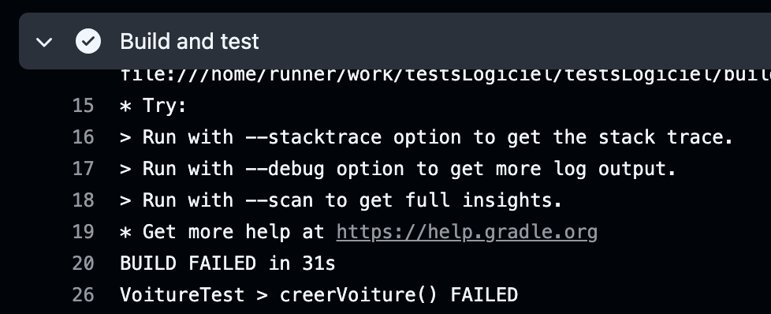
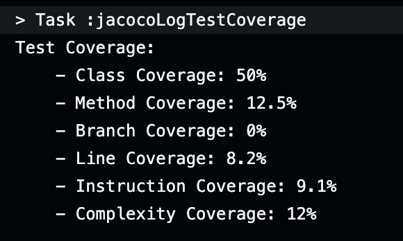

# Qualité de développement

Le but de ce cours est de faire des tests d'intégration au fur et à mesure que des nouveaux composants sont intégrés dans une apllication 
tout en vérifiant que les tests précédents continuent de passer sans relever d'erreur. 
On appelle cela des tests de non regression.

Un projet vous est fourni. Il contient du code Java. A vous d'écrire les programmes de test.

## Support de cours

https://drive.google.com/drive/folders/1RVLc4yg5IKTq3OSht6wm1Cdjq9jOLEqy?usp=sharing

# Appropriation du projet

Vous devez vous appropier ce projet, c'est-à-dire que vous devez;

- le déplacer vers un dépôt Git appartenant à vous ou votre binôme
- inviter votre binôme à collaborer au projet 

Pour cela commencer par cloner ce projet :
```
git clone https://github.com/charroux/testsLogiciel
```
Déplacez-vous dans le dossier du projet.

Créez ensuite un projet vide dans un de vos compte Github et utiliser les instructions suivantes pour copier le projet vers votre comopte Github en indiquat le nom de votre repository dans l'instruction git remote.

```
git init
git add .
git commit -m "first commit"
git branch -M main
git remote add origin https://github.com/charroux/test1.git
git push -u origin main
```

Si nécessaire supprimer le lien avec l'origine existante : 
```
git remote remove origin
```

et refaire le add remote.

# Collaborer à un projet : le concept du pull request

Quand un développeur collabore à un projet il porocède de la façon suivante : 

- il récupère le projet sur sa machine (git clone)
- il créé une copie du projet afin de ne pas affecter le code qui est déjà en production (git branch et git checkout)
- il travail à débogeur le code ou à développer une nouvelle fonctionnalité (git add, git commit)
- il écrit aussl les programmes de tests qui valident son travail
- et enfin il envoie sa copie du code vers le serveur git (git push)

Le chef de projet peut alors déclencher un processus d'intégration continue (CI) en lançant les procédures de tests écrit oar le développeur :
 c'est le pull request. Un script va alors être déclanché sur un serveur de test. 
Si les tests du développeurs sont concluants, le chef de projet peut alors décider de fisionner la copie du développeur avec la version originale (git marge).
 Tous les développeurs doivent alors récupérer la mise à jour du code sur leur machine en faisant un git pull. 
Et c'est là qu'on comprend le terme pull request qui est finalament une demande de pull faite par un développeur au chez de projet quand il a finit son travail.

DES LORS QUE LE CODE EST TESTÉ SUR LES SERVEURS DE GITHUB, VOUS POUVEZ UTILISEZ N'IMPORTE QUEL ÉDITEUR DE TEXTE SUR VOTRE MACHINE POUR CODER.

## Premier essai de pull request

### Launch a workflow when the code is updated

Créer une nouvelle branche sur votre machine:
```
git branch newcarservice
```
Se déplacer vers la nouvelle branche:
```
git checkout newcarservice
```
Modifier puis mettre à jour avec un :
```
git commit -a -m "newcarservice"
```
Se remettre sur la brnache main:
```
git checkout main
```
Envoyer les changements vers GitHub :
```
git push -u origin newcarservice
```
A partir de là, vous jouez le rôle d'un chef de projet.

Créer un pull request chez Github en comparant la nouvelle branche avec la votre. 
C'est un ce moment là qu"un script d'intégration continue va se déclencher chez Github. 
Goithub trouve le code de ce script dans votre projet : https://github.com/charroux/testsLogiciel/blob/main/.github/workflows/action.yml
Etudiez ce script et suivez son bon déreoulement chez Github. Si tout va bien, vous pourrez alors "merger" les branches chez Github.

NE PAS OUBLIER de faire alors un 
```
git pull origin main
```
Sur toutes les machines des développeurs (y-compris celle du développeur qui a soumis son code) afin de mettre à jour la branche main sinon le serveur Github n'acceptera pas de nouveau push au pretexte que le code n'est pas à jour.

La nouvelle branche peut alors être effacée sur la machine du développeur est chez Github :

```
git branch -D newcarservice
```
```
git push origin --delete newcarservice
```


# TD 1 - JUnit

JUnit est un framework de test unitaire pour le langage de programmation Java, créé par Kent Beck et Erich Gamma.

Etudier un exemple de classe de Test : https://junit.org/junit5/docs/current/user-guide/#writing-tests

Etudier l'utilisation des assertions : https://junit.org/junit5/docs/current/user-guide/#writing-tests-assertions

# TP 1 - JUnit

Dans ce TP vous allez écrire le programme de test d'une classe qui vous est donnée :
https://github.com/charroux/testsLogiciel/blob/main/src/main/java/com/example/demo/data/Voiture.java

Etudiez cette classe et écrivez à la norme JUnit le programme de test. Une ébauche du programme de test ce trouve ici : 

https://github.com/charroux/testsLogiciel/blob/main/src/test/java/com/example/demo/data/VoitureTest.java

ATTENTION ! PENSEZ BIEN A CODER LE PROGRAMME DE TEST DANS UN NOUVELLE BRANCHE COMME INDIQUÉ CI-DESSUS, puis faites une demande pull request.

Les tests qui vont échouer seront affichés chez Github :




# TD 2 - Spring boot test et Mockito

Etude du framework de test inclus dans les projets Spring boot : https://github.com/charroux/springbootest

Etude du framework de test Mockito: https://github.com/charroux/mockito

# TP 2

## Présentation de l'application

L'application développée sur la base des voitures calcule des statistiques sur les voitures. La base de cette application est une interface : 

https://github.com/charroux/testsLogiciel/blob/main/src/main/java/com/example/demo/service/Statistique.java

Cette interface utilise une classe Echantillon : https://github.com/charroux/testsLogiciel/blob/main/src/main/java/com/example/demo/service/Echantillon.java

Son implantation et donnée : https://github.com/charroux/testsLogiciel/blob/main/src/main/java/com/example/demo/service/StatistiqueImpl.java

Votre tâche consiste à écrire la classe de test en utilisant le framework Mockito : https://github.com/charroux/testsLogiciel/blob/main/src/test/java/com/example/demo/service/StatistiqueTests.java

# TD 2 - MockMvc

MockVvc est un framework de test qui permet de tester un application Web programmé en Java version Spring. 
Essentiellement, ce framework envoi des requêtes HTTP à un programe Web Java et vérifier que les réponses sont celles attendues.

Comment faire des requêtes : https://docs.spring.io/spring-framework/reference/6.0/testing/spring-mvc-test-framework/server-performing-requests.html

Comment vérifier les résultats des requêtes : https://docs.spring.io/spring-framework/reference/6.0/testing/spring-mvc-test-framework/server-defining-expectations.html

# TP 3 - MockMvc

## Le service Web

L'application de la question précédente est utilisé la un service Web dont voici le code : https://github.com/charroux/testsLogiciel/blob/main/src/main/java/com/example/demo/web/StatistiqueController.java

Votre travail consiste à écrire la classe de test correspondante : https://github.com/charroux/testsLogiciel/blob/main/src/test/java/com/example/demo/web/WebTests.java

```
curl --header "Content-Type: application/json" \   
  --request POST \
  --data '{"marque":"f","prix":100}' \
  http://localhost:8080/voiture
```

# TP 4

## Tests de couverture de code

Le script d'intégration coninue qui s'exécute chez Github contient déjà un programme de couverture de code (voir à la fin l'instruction ./gradlew jacocoTestReport) : https://github.com/charroux/testsLogiciel/blob/main/.github/workflows/action.yml

Vérifiez que votre script conient cette instruction et ajoutez-là si ce n'est pas le cas. 

Gradle (l'outil de compilation) requiert un plugin pour générer le rappprt de converture de code. 
Ce plugin doit être indiqué par l'instruction (id 'org.barfuin.gradle.jacocolog' version '1.0.1') dans le fichier de configuration du projet (en ligne 6) : https://github.com/charroux/testsLogiciel/blob/main/build.gradle

Quand le script d'intégration continue s'exécute le rapport généré contient les résultats de la couverture de code :



Ce rapport n'est pas très détaillé et donc pas très facile à exploiter ! Cependant, il est suffisant pour vous rendre compte si vos programmes de tests garantissent une bonne couverture de code. Si ce n'est pas le cas, à vous d'ajouter des cas de tests pour améliorer la couverture de code.
Si vous souhaitez avec un rapport de couverture de code plus détaillé, vous pouvez lancer le test de couverture sur votre machine via : 

```
./gradlew jacocoTestReport
```

Mais encore faut-il que votre machine dispose de Java JDK 17.
